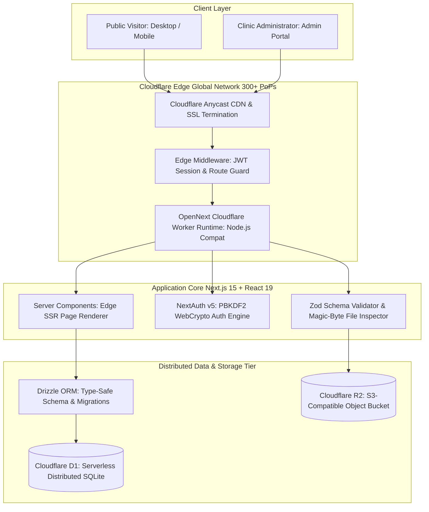

<div align="center">

# 🌸 AESTHETIC CLINIC CMS — Edge-First Full-Stack Web Application

**High-Performance Edge-Native Medical Aesthetics Platform & Headless CMS Built with Next.js 15, React 19, Cloudflare Workers, D1 SQL Database & R2 Object Storage**

[](https://cms-klinik-kecantikan.pangestudev.web.id/)
[](https://cms-klinik-kecantikan.pangestudev.web.id/admin/login)
[](https://nextjs.org/)
[](https://react.dev/)
[](https://workers.cloudflare.com/)
[](https://developers.cloudflare.com/d1/)
[](https://developers.cloudflare.com/r2/)
[](https://orm.drizzle.team/)
[](https://www.typescriptlang.org/)
[](https://tailwindcss.com/)

<p align="center">
  <a href="https://cms-klinik-kecantikan.pangestudev.web.id/">🌐 Live Clinic Website</a> •
  <a href="https://cms-klinik-kecantikan.pangestudev.web.id/admin/login">🔐 Admin CMS Portal</a> •
  <a href="#-executive-summary-why-this-project-stands-out">Why This Project Stands Out</a> •
  <a href="#-technical-stack--system-architecture">Architecture & Tech Stack</a> •
  <a href="#-deep-dive-architectural-solutions--engineering-challenges">Engineering Deep-Dive</a> •
  <a href="#-complete-feature-matrix">Feature Matrix</a> •
  <a href="#-developer-profile--contact">Developer Contact</a>
</p>

</div>

---

## 📌 Executive Summary: Why This Project Stands Out

**Aesthetic Clinic CMS** is an edge-first, production-grade web application and content management system engineered by **Urip Yoga Pangestu** (`pangestudev`). Designed specifically for medical aesthetics practices and beauty clinics, it replaces slow traditional monolithic CMS setups with an **ultra-responsive edge computing architecture powered by Cloudflare Workers, Cloudflare D1 distributed SQL, and Cloudflare R2 object storage**.

Unlike standard CMS websites hosted on shared servers with multi-second cold starts and database latency, this application executes **Server-Side Rendering (SSR) and dynamic database queries across 300+ global Cloudflare edge locations**, delivering sub-50ms Time to First Byte (TTFB), rock-solid security, and effortless scaling.

### 💡 Core Engineering Highlights:
- ⚡ **Global Edge-First Architecture**: Built on **Next.js 15 (App Router)** and deployed to **Cloudflare Workers** via `@opennextjs/cloudflare`—zero cold starts, high concurrency, and instant edge execution.
- 🗄️ **Serverless Relational Data Tier**: Powered by **Cloudflare D1** with **Drizzle ORM**, providing fully typed, zero-latency SQL querying without connection pool bottlenecks.
- 🔒 **Zero-Trust Edge Security & Timing-Safe Auth**: Protected by **NextAuth v5 (Auth.js Beta)** with pure **Web Crypto API PBKDF2** hashing (100,000 iterations) and bitwise XOR constant-time comparison to prevent timing side-channel attacks.
- 🖼️ **Robust R2 Media Pipeline with Magic-Byte Inspection**: Direct integration with **Cloudflare R2** via AWS S3 SDK v3, featuring binary magic-number validation (JPEG, PNG, WebP, GIF) and pre-flight `Content-Length` enforcement to prevent Worker RAM exhaustion.
- 🎛️ **Modular Headless Content Management**: Complete admin control over clinic branding, WhatsApp direct booking funnels, interactive before/after treatment comparisons, doctor directories, and promotional banners.
- 📈 **Dynamic Real-Time SEO Engine**: Automated OpenGraph and meta tag generation fetched directly from the edge database per request, ensuring high search engine visibility.

---

## 🏗️ Technical Stack & System Architecture



### 🛠️ Technology Stack Breakdown

| Layer | Technologies | Engineering Purpose & Implementation |
| :--- | :--- | :--- |
| **Framework & Core** | `Next.js 15` + `React 19` + `TypeScript 5` | Edge Server Components (RSC), App Router, dynamic edge routing, strict type safety |
| **Edge Compute Runtime** | `@opennextjs/cloudflare` + `Wrangler` | Compiles Next.js into Cloudflare Workers format with `nodejs_compat` support |
| **Database & ORM** | `Cloudflare D1` + `Drizzle ORM` | Distributed serverless SQLite at the edge, zero connection pooling overhead, compile-time type safety |
| **Media & Object Storage** | `Cloudflare R2` + `@aws-sdk/client-s3` | High-speed global object storage for logos and clinic before/after photos with zero egress fees |
| **Authentication** | `NextAuth v5 (Auth.js)` + JWT | Edge-compatible session management, protected admin routes, zero server state |
| **Cryptography & Security** | Web Crypto API (`PBKDF2` + XOR) | 100,000 SHA-256 iterations, edge password derivation, timing-safe string comparison |
| **Styling & Design System** | `Tailwind CSS` + `Radix UI` + `Lucide` | Accessible UI primitives, responsive medical-grade aesthetics, custom theme tokens |
| **UX & Motion** | `AOS` + `React Slick` + `react-hot-toast` | Smooth scroll animations, responsive carousels, instant asynchronous feedback |
| **Form Handling & Validation** | `React Hook Form` + `Zod` | Client & server schema validation, type-safe payload sanitization |

---

## 🔬 Deep-Dive: Architectural Solutions & Engineering Challenges

### 1. True Edge-Native Execution with OpenNext & Cloudflare D1
- **Problem**: Next.js App Router applications typically rely on long-running Node.js servers and heavy relational database drivers (PostgreSQL/MySQL connection pools), which suffer from cold starts and cannot run directly in lightweight V8 edge isolates.
- **Solution**: Engineered the application using `@opennextjs/cloudflare` paired with `drizzle-orm/d1`:
  - Directly binds to Cloudflare's native D1 SQLite engine via `getCloudflareContext().env.symposium_cms`.
  - Configured `export const dynamic = "force-dynamic"` to guarantee fresh CMS database reads per request while preserving sub-millisecond edge database queries.
  - Zero connection pool limits—scale horizontally to handle traffic surges with zero server provisioning.

### 2. Timing-Attack Safe PBKDF2 Password Verification on the Edge
- **Problem**: Edge workers run in secure V8 isolates without native C++ `bcrypt` or `argon2` bindings. Furthermore, naive string comparisons (`stored === input`) allow attackers to deduce passwords character-by-character through microsecond timing variations (timing side-channel attacks).
- **Solution**: Implemented a pure **Web Crypto API** cryptographic module:
  - Derives keys using **PBKDF2** with 100,000 iterations of **HMAC-SHA-256** and cryptographic salt.
  - Executes constant-time verification using bitwise XOR accumulation (`diff |= derivedHex.charCodeAt(i) ^ hashHex.charCodeAt(i)`).
  - Unconditionally runs verification even on non-existent emails to prevent user enumeration attacks.

### 3. High-Security Media Upload Pipeline (Magic-Byte Inspection & Worker RAM Protection)
- **Problem**: In serverless edge environments, Workers have strict RAM ceilings (128MB). Naively reading multi-megabyte payloads via `request.formData()` can trigger Out-Of-Memory (OOM) worker crashes. Additionally, relying on browser `file.type` headers exposes systems to file spoofing vulnerabilities.
- **Solution**: Engineered a multi-stage defensive upload pipeline:
  - **Pre-flight Header Check**: Inspects `Content-Length` before loading the body into memory, immediately rejecting payloads exceeding 5MB with HTTP `413 Payload Too Large`.
  - **Binary Magic-Byte Inspection**: Examines raw file signature bytes via `Uint8Array` (JPEG `FF D8 FF`, PNG `89 50 4E 47`, WebP `52 49 46 46`, GIF `47 49 46 38`), preventing disguised executables or malicious scripts from being uploaded.
  - **Sanitized UUID Storage**: Strips client filenames and generates cryptographic UUID keys (`Date.now()-UUID.ext`) to eliminate path traversal attacks, storing assets directly to **Cloudflare R2** with immutable cache headers.

### 4. Dynamic SEO & Edge Metadata Generation
- **Problem**: Aesthetic clinics and healthcare practices depend on local search rankings and dynamic OpenGraph previews when sharing services on WhatsApp or social media.
- **Solution**: Implemented Next.js `generateMetadata()` running on Cloudflare Workers, pulling the latest clinic name, SEO title, and meta description from Cloudflare D1 per request, providing instant search engine indexing updates without requiring site rebuilds.

---

## ✨ Complete Feature Matrix

| Feature Category | Capabilities & Specifications |
| :--- | :--- |
| **🏥 Landing Page Experience** | **Hero Showcase**, **Interactive Before & After Treatment Visualizer**, **Service & Price Catalog**, **Doctor Profiles**, **Patient Testimonials Carousel**, **Flash Promos**, **FAQ Accordion**, **Floating WhatsApp Consultation** |
| **🎛️ Admin Content Studio** | Visual dashboard overview with active block counters, completion checklists, and recent activity logs; full CRUD management for all website blocks |
| **🔄 9 Content Block Types** | Dedicated schema support for `hero`, `about`, `service`, `doctor`, `testimonial`, `promo`, `stat`, `before_after`, and `faq` |
| **⚡ Instant Status Toggle** | One-click activation/deactivation of any content block without deleting database records |
| **🎨 Site Settings Manager** | Clinic Name, Logo, Brand Color Theme, WhatsApp Direct Number, Physical Address, Operational Hours, and Social Media links (Instagram, Facebook, TikTok) |
| **🔍 Search Engine Optimization** | Dynamic SEO Title & Meta Description editable from CMS; dynamic OpenGraph generation |
| **🛡️ Edge Security & Auth** | NextAuth v5 session cookies, protected `/admin/*` middleware, PBKDF2 edge hashing, CSRF protection |
| **📦 Cloudflare R2 Media Vault** | Direct image uploading with magic-byte verification, zero egress bandwidth costs, instant CDN preview |

---

## 🚀 Local Development Setup

### 1. Prerequisites
- **Node.js**: `v18.0.0+`
- **Package Manager**: `npm`, `pnpm`, or `bun`
- **Cloudflare Account & Wrangler CLI** (for D1/R2 bindings)

### 2. Installation & Quick Start

```bash
# Clone repository
git clone https://github.com/timurlauttt/pilot-project.git
cd pilot-project

# Install dependencies
npm install

# Setup environment variables
cp .dev.vars.example .dev.vars

# Run local database migrations
npx wrangler d1 migrations apply symposium_cms --local

# Start Next.js development server
npm run dev
# Open http://localhost:3000 in your browser
```

### 3. Cloudflare Edge Build & Deployment

```bash
# Test OpenNext Cloudflare Worker build locally
npm run cf:build

# Preview with Wrangler local edge simulator
npm run cf:preview

# Deploy to Cloudflare Workers production
npm run cf:deploy
```

---

## 👨‍💻 Developer Profile & Contact

This project is engineered with passion by **Urip Yoga Pangestu** (`pangestudev`).

- **Role**: Junior Full Stack Web Developer & DevOps Enthusiast
- **Certifications**:
  - **BNSP Certified Web Developer** *(Badan Nasional Sertifikasi Profesi)*
  - **Google AI Professional Certificate**
  - **Google Cybersecurity Certificate**
- **Core Stack**: Next.js 15, React 19, Cloudflare Workers/D1/R2, TypeScript, Tailwind CSS, Laravel, PHP 8.2, Linux VPS, Nginx, Docker

### 📬 Recruitment & Collaboration Inquiries:

<div align="center">

| Channel | Link |
| :--- | :--- |
| **🌐 Portfolio Website** | [pangestudev.web.id](https://pangestudev.web.id) |
| **💼 LinkedIn** | [linkedin.com/in/urip-yoga-pangestu-65a541231](https://www.linkedin.com/in/urip-yoga-pangestu-65a541231/) |
| **📧 Direct Email** | [hello@pangestudev.web.id](mailto:hello@pangestudev.web.id?subject=Aesthetic%20Clinic%20CMS%20Inquiry%20/%20Hiring) |
| **💬 WhatsApp** | [+62 858-6146-6287](https://wa.me/6285861466287?text=Halo%20Urip,%20kami%20tertarik%20dengan%20proyek%20Aesthetic%20Clinic%20CMS%20Anda) |
| **🐙 GitHub** | [@timurlauttt](https://github.com/timurlauttt) |

</div>

---

<div align="center">
  <p>© 2026 <strong>pangestudev</strong> (@timurlauttt). Open for full-time engineering roles and freelance opportunities.</p>
  <p>Engineered with modern edge-first web standards, high-security practices, and zero-server-maintenance philosophy.</p>
</div>